# Manual: Head-Fixed Setup

To find 3D designs and print them, see the [`hardware/`](../hardware) folder in this repository.

Our head-fixed setup is composed of different parts which are illustrated one by one in this
manual. All files that you may need during preparation steps are included in this repository.

## Contents

- [Boxes](#boxes)
  - [Touchshaker Box](#touchshaker-box)
  - [Breakout Box](#breakout-box)
    - [Tools](#tools)
    - [List of components](#list-of-components)
    - [Lid preparation](#lid-preparation)
    - [PCB Preparation](#pcb-preparation)
    - [Photo Diode](#photo-diode)
- [Platform](#platform)
- [Rotary encoder and wheel](#rotary-encoder-and-wheel)
- [Motors and Spouts](#motors-and-spouts)
  - [Spout preparing](#spout-preparing)
  - [Stereo cables](#stereo-cables)
  - [Cable preparation](#cable-preparation)
  - [Wiring of the signal wires](#wiring-of-the-signal-wires)
  - [Wiring of the zero-position wires](#wiring-of-the-zero-position-wires)
  - [Grounding](#grounding)
  - [Test your signal](#test-your-signal)
- [Tactile stimuli system](#tactile-stimuli-system)
- [Air-Puff Delivery](#air-puff-delivery)
- [Visual stimuli system](#visual-stimuli-system)
- [Auditory stimuli system](#auditory-stimuli-system)
- [Water providing system](#water-providing-system)
- [Camera and recording system](#camera-and-recording-system)
  - [First step: IR filter removal](#first-step-ir-filter-removal)
  - [Second step: Mounting the camera](#second-step-mounting-the-camera)
  - [Third step: Lens mounting](#third-step-lens-mounting)
  - [Fourth step: Mounting the IR LED](#fourth-step-mounting-the-ir-led)
  - [Optional step: Mounting the IR mirror](#optional-step-mounting-the-ir-mirror)
- [Bpod system](#bpod-system)
- [Labcams installation](#labcams-installation)

## Boxes

In the proposed setup we designed two customized PCBs (Printed Circuit Boards):
1. Touchshaker PCB (also referred to as the Spout controller PCB)
2. Breakout PCB

These two PCBs are housed within custom enclosures equipped with appropriate sockets and
connected via Ethernet cables.

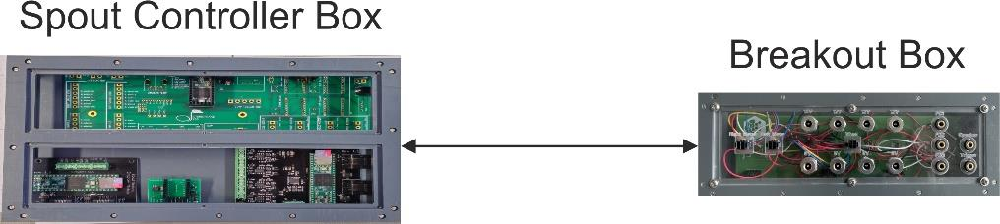

In order to prepare each box, follow these instructions:

### Touchshaker Box

> The original build figures and hardware silkscreen label this the "Spout controller Box" — it's
> the same enclosure referred to as the **Touchshaker box** everywhere else in this manual, in
> `docs/connections.png`, and in [`hardware/touchshaker/`](../hardware/touchshaker).

- Touchshaker PCB
- Bpod Teensy shield
- Bpod input module
- Bpod rotary encoder module
- Box (assemble the box based on the location of modules and prints over the panels of the box)

After you assemble the box, put all components in the box. The box is then ready to be connected
to the breakout box using Ethernet connections.

### Breakout Box

#### Tools

- Soldering iron
- Crimping tool
- Side cutter
- Screw drivers
- "Helping hand"

#### List of components

- Custom Breakout PCB
- Custom surrounding box
- 8x [Power Jacks RND](https://www.distrelec.ch/de/power-jacks-rnd/pf/2017224)
- 5x [Phone Audio connector, 3 Contacts, Jack, 3.5 mm](https://de.farnell.com/pro-signal/mj-073h/klinkenbuchse-3-5mm-3pol/dp/1267396?pf_custSiteRedirect=true)
- 3x [Plug Housing, Dual Row, with Panel Mount Ears, 4-Circuits](https://de.rs-online.com/web/p/steckergehause-und-stecker/2332810)
- 26x Oval-Head M3x8 SS
- 12x [Crimp Terminal, Male, with Select Gold (Au) Plated Tin/Brass Alloy](https://de.rs-online.com/web/p/crimpkontakte/6794782)
- 4x [Modular Telephone Jack, 8P8C Right Angle, PCB](https://www.digikey.de/en/products/detail/adam-tech/MTJ-881X1/9832263)
- Solder
- [26 AWG Wire (different colors)](https://de.rs-online.com/web/p/schaltdraht/7417979?gb=s)

Inside this box you just have the breakout PCB:

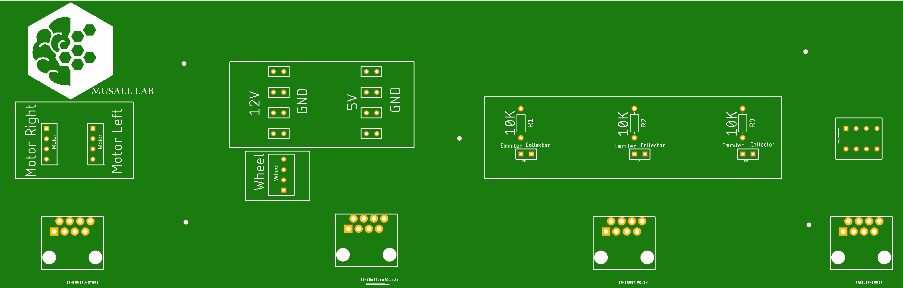

The box consists of 3 main parts:
1. Motors
2. Wheel and power sources
3. Photo diodes

#### Lid preparation

Fasten all audio connectors and power jacks to the dedicated holes in the lid using the enclosed
screw nuts.

To prepare the power source connections, the pins must be soldered to ~10 cm long 26 AWG wires
as follows:

- Long pin → GND holes
- Short pin → Positive holes

De-isolate ~2 mm at the end of each wire and put some solder on the ends. Fill the connections of
the power jacks with solder as well. Now melt the solder on the power jack connections again and
insert one end of a wire each. Wait until hardened and use a shrinking tube to isolate the
connection. Repeat this for the audio connections.

For the plug housing, start preparing the wires as before. Then use a crimp tool to attach the
wires to the male crimp terminals. To ensure a proper connection, merge the wire and the crimp
terminal with a small amount of solder. Ensure that no stripped wire is outside of the crimp
terminals and that it is only in the crimped area (not in the tip of the crimp terminal). Now
push the prepared crimp terminals into the plug housing. Afterwards, push the housings into the
dedicated spots in the lid.

#### PCB Preparation

Push the RJ45 Ethernet jacks into the dedicated spot of the PCB and solder the pins to the
contacts of the PCB.

| | |
|---|---|
| 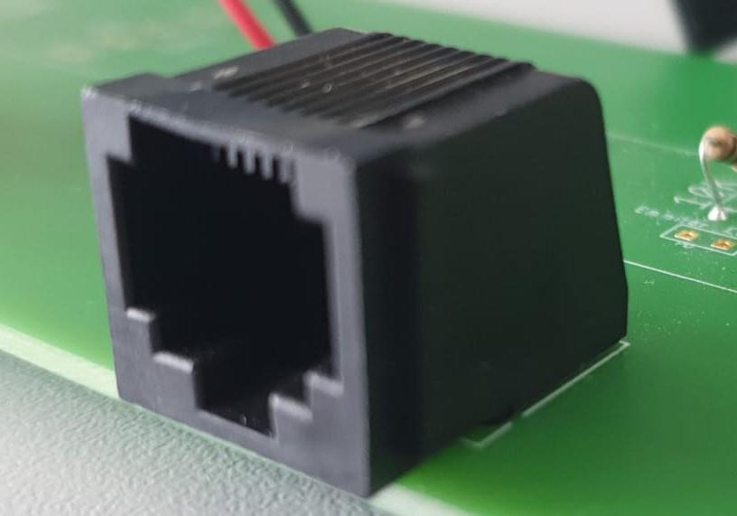 | 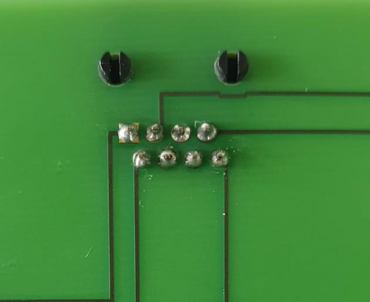 |

Connect the other end of the wires that you soldered to the plugs to the associated holes in the
PCB, and fixate them by soldering them to the contacts:

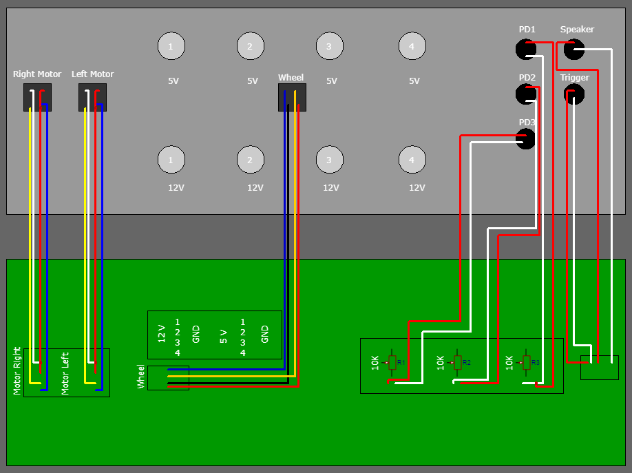

Put everything in the box and glue the telephone jacks to the panel. When the glue has dried,
screw all panels to the box.

#### Photo Diode

The following picture shows the general configuration of a photo diode.

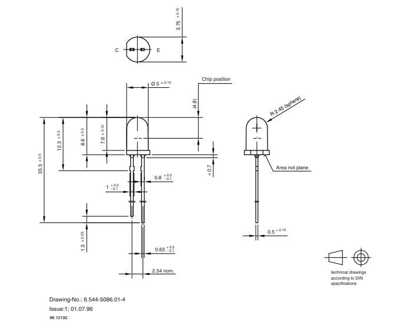

**First step: Wire up the photo diode**

To wire up the photo diode, start by removing the cable jacket of the stereo cable. Next, solder
the longer pin of the photo diode to the white wire and the shorter pin to the red wire. Note that
the shielding (small surrounding wires) should be left unconnected in this specific case.

In summary:
- White wire: Anode / Longer pin / Emitter
- Red wire: Cathode / Shorter pin / Collector

The following pictures show the process and final result:

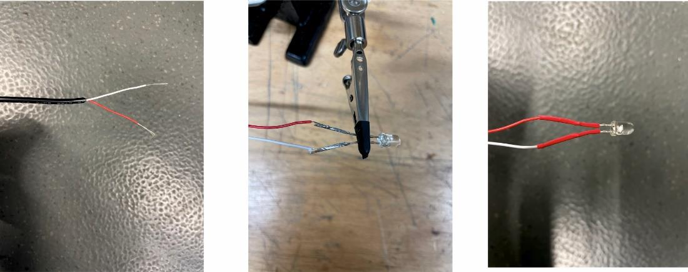

**Second step: Preparing the breakout PCB section**

There is a section on the breakout PCB related to the photo diode, to which you need to solder
the components. The first component is a set of 10k resistors (see the breakout PCB image above
for their location on the board).

There are three stereo sockets in the lid of the breakout box that are dedicated to the PDs.
Solder the respective stereo pins of the plug to the emitter/collector holes in the PCB via a
cable.

**Third step: Preparing the Touchshaker box**

As mentioned before, there is a dedicated Ethernet connection for PDs between the breakout box and
the Touchshaker box. As a final step you need to prepare the Ethernet socket on the Touchshaker
side. If you consider the Ethernet breakout board as below:

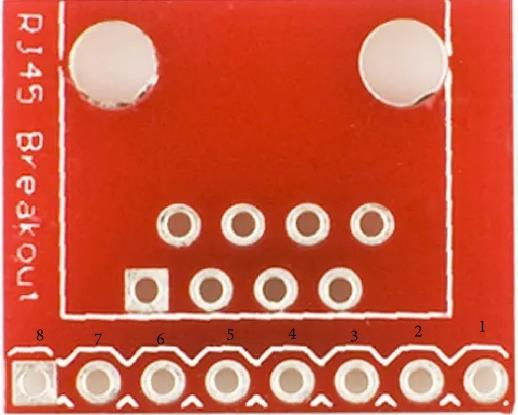

In order to prepare the PD Ethernet socket in the Touchshaker box, you need to solder three wires
to pins 8 / 7 / 6 and connect them to the positive pins on the Bpod input module inside the
Touchshaker box. Alternatively, you can solder the cables directly to an Ethernet socket in the
box.

In summary:
| Ethernet breakout board pin | Bpod input module |
|---|---|
| Pin 8 | 1+ input channel |
| Pin 7 | 2+ input channel |
| Pin 6 | 3+ input channel |
| Pin 2 | 1-, 2-, 3- input channels |

## Platform

- Thorlabs platform
- Thorlabs poles
- Thorlabs base

Assemble poles on the platform for each component of your setup that you want to fix to the
platform. You may need to adjust their positions later to ensure that everything fits properly and
you get proper videos of your test subjects.

## Rotary encoder and wheel

- Wheel (3D-print)
- Wheel holder (3D print)
- Rotary encoder
- Rotary encoder holder (3D print)

1. Attach the wheel to the wheel holder.
2. Attach the rotary encoder to the rotary encoder holder.
3. Attach the wheel to the rotary encoder using the wheel holder.
4. Attach a Thorlabs pole to the rotary encoder holder.
5. Place everything on the platform.
6. Connect the rotary encoder to the Breakout Box using the "Wheel" 4-pin plug on the Breakout
   box. (You need to prepare the rotary encoder cable with a male 4-pin jack.)

## Motors and Spouts

- Stepper motors
- Spouts
- Spout holders (3D design)
- Motor holder (3D design)
- Motor wires (depends on the motor type)
- Shrinking tubes
- Stereo cables
- 4-pole crimp connectors + housings (female and male)
- Optional: [specific core wires with multiple small wires](https://www.aliexpress.com/item/33022308653.html)
  for improved cable management

**First step: Prepare your motor wiring**

Remove the cable jacket to access the 8 small wires inside it. Connect these 8 small wires to two
different male 4-port connection sockets. Connect 4 wires of each motor to a female 4-port
connection socket.

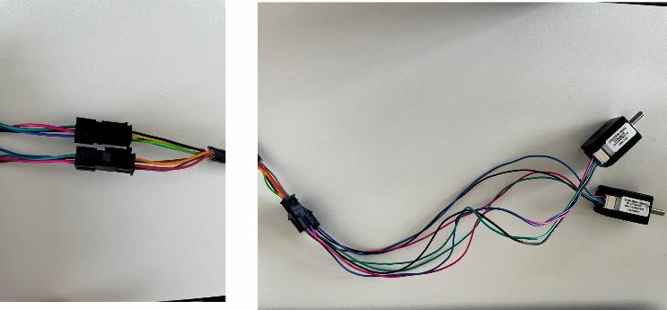

**Second step: Connect the free end to the breakout PCB using the following order.**

Be aware that the color coding of motors is important in this step. Depending on the motor you are
using, you may have 4 different colors of wire per motor:

- German version: red / blue / yellow / orange
- US version: black / green / blue / red

After checking all color codes, solder the free end to the PCB in this order (from top): Black /
Green / Blue / Red.

### Spout preparing

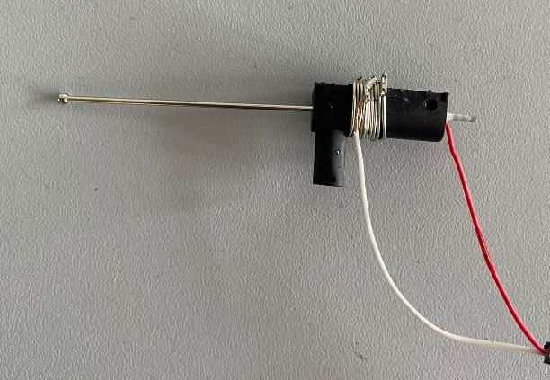

### Stereo cables

For each lick detection system, 3 stereo cables are needed:

| Cable | Purpose |
|---|---|
| Cable 1 | Signal 1 |
| Cable 2 | Signal 2 |
| Cable 3 | Zero position and grounding |

### Cable preparation

Take off the plastic shielding on all three stereo cables. Each cable will reveal two wires: red
and white (or yellow). The red wire carries the desired (licking) signal.

### Wiring of the signal wires

Select the red wire from the stereo cables and solder it to the end of the metal body of the spout
(you can wrap it around the spout first and then solder it). Ensure that the soldered part fits
securely inside the spout holder. Finally, use a shrinking tube to secure and stabilize the
connection.

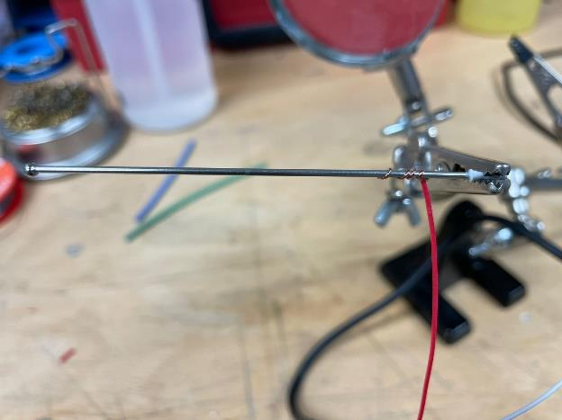

Now connect your stereo cable to the stereo sockets labeled "Spout Left" and "Spout Right" on the
Touchshaker box.

### Wiring of the zero-position wires

Insert the spout into the holder and fasten it by screwing it tightly. Then wrap a metal wire
around the spout holder to provide additional stability. Solder the white wire from cable 3 to the
wrapped wire of spout 1, and solder the red wire from cable 3 to the wrapped wire of spout 2.

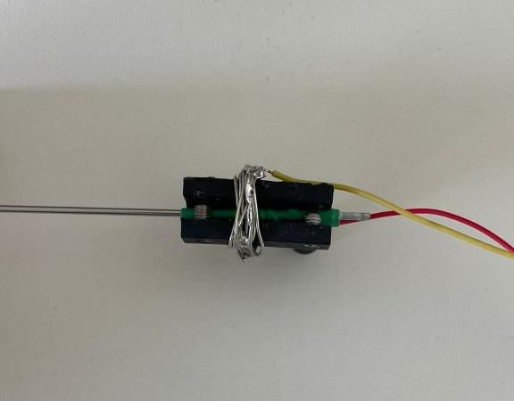

### Grounding

On each motor holder there are designated spots where screws need to be inserted. Take the
shielding cables from the third stereo cable and solder them to both screws on the motor holder.
Connect the third cable to the "Motor Zero" socket on the Touchshaker box.

Congratulations! Your spout is now successfully assembled and ready to be used.

### Test your signal

Attach the spouts on top of the motor holder carefully, since holders are fragile. To test the
spouts, run the paradigm using Bpod and change the position of the spout using the GUI.

Furthermore, to verify the adequacy of the licking signal, open the Arduino IDE, run
[`firmware/touchshaker/TouchShaker/TouchShaker.ino`](../firmware/touchshaker/TouchShaker/TouchShaker.ino),
and open the serial monitor. Signals without any licks should resemble:

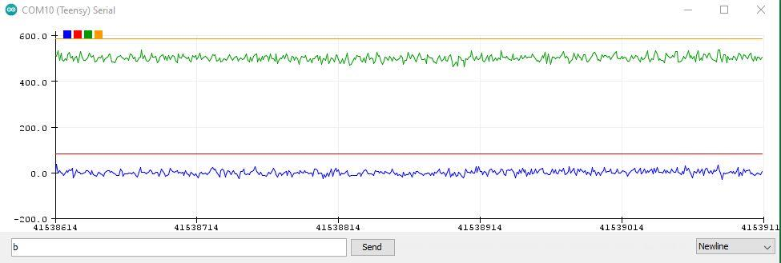

If the signals appear noisy or distorted, double-check the connections and soldered spots
meticulously to ensure a proper and stable connection.

Next, gently touch the top of each spout with a slightly wet finger. You should observe a signal
similar to:

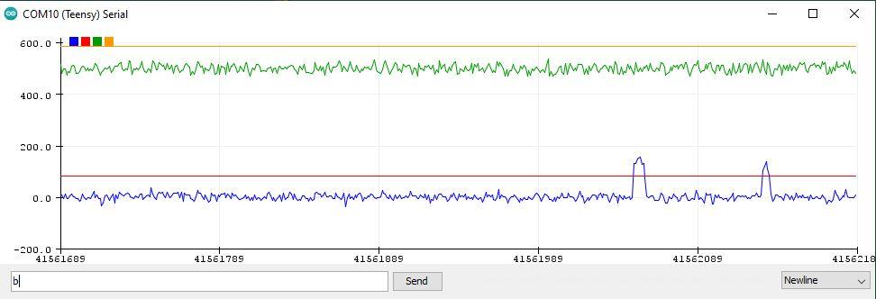

## Tactile stimuli system

- Spouts
- Spouts holder (3D design)
- Bpod port interface
- Tubes
- T-connector
- Valves
- Air compressor system
- Air pressure regulator

To set up the pneumatic tactile feedback system, follow these detailed steps:

1. **Connect the pressure regulator to the compressor system.** Take a suitable air tube and
   connect one end to the output port of the air compressor. Attach the other end of the tube to
   the input port of the pressure regulator. Ensure the connection is secure to prevent air leaks.
2. **Mount the valve to the Bpod port interface.** Locate the Bpod port interface on your system.
   Securely mount the solenoid valve to the designated port on the Bpod interface, ensuring it is
   properly aligned and firmly attached.
3. **Connect the tubing.** Attach one end of a tube to the output port of the pressure regulator
   and connect the other end to the first input port of the valve. From the second output port of
   the valve, connect a soft, flexible tube long enough to reach your desired location without
   causing delays or pressure drops. Attach the free end of this soft tube to the air puff
   connection on the camera holder.

**Detailed steps with additional considerations:**

1. *Connecting the pressure regulator:* Ensure the air compressor is turned off before making any
   connections. Check that the pressure regulator is rated for the output pressure of your
   compressor. Use hose clamps if necessary to ensure airtight connections between the compressor
   and the pressure regulator.
2. *Mounting the valve:* The Bpod port interface typically has specific slots or connectors for
   mounting peripherals — refer to the Bpod documentation for exact mounting procedures.
3. *Connecting the tubing:* Cut the tubing to the required lengths using a sharp utility knife to
   avoid uneven edges which could cause leaks. Secure all tubing connections with appropriate
   fittings or hose clamps. Double-check all connections for tightness — loose connections can
   lead to loss of pressure and ineffective tactile feedback.

**Final checks and testing:**

- *System integrity:* After all connections are made, ensure the entire system is securely
  connected and there are no potential points for air leakage.
- *Pressure adjustment:* Adjust the pressure regulator to the desired level suitable for your
  tactile feedback requirements.
- *Operational test:* Turn on the compressor and check for leaks. Then operate the system to
  ensure that the valve correctly modulates air flow to the air puff connection on the camera
  holder.
- *Calibration:* If necessary, calibrate the system by adjusting the regulator and valve settings
  to achieve the desired tactile stimulus.

## Air-Puff Delivery

Air-puff stimuli were delivered using solenoid valves (NPV2-1C-03-12, Clippard, USA) connected to
compressed air sources via silicone tubing (inner diameter: 1 mm; outer diameter: 3 mm). Air was
directed through blunt-ended cannulas with an outlet diameter of 1 mm. The cannula tip was
positioned 1 cm from the animal's face.

The cannula was oriented at an angle of 35° relative to the horizontal plane, directing airflow
from above toward the whisker pad while minimizing direct stimulation of the eyes. Depending on
the experimental objective, the cannula position can be adjusted to target different facial
regions.

Two behavioral setups were used, differing in tubing length and pneumatic configuration. To
compensate for these differences, air pressure was adjusted individually for each setup (2.0–2.2
bar) to achieve comparable airflow intensity at the animal. Because the effective stimulus
strength depends on multiple factors, including valve characteristics, tubing length, tubing
diameter, and tubing material, pressure values alone are not sufficient to fully characterize the
stimulus. Instead, the airflow reaching the animal should be calibrated empirically for each
setup.

For sensory stimulation experiments, air-puff durations of 20 ms or 70 ms were used depending on
the experimental paradigm. Air-puff intensity can be modulated by varying pulse duration, applied
pressure, or both. In addition to their use as sensory stimuli, longer-duration or higher-intensity
air puffs can be employed as aversive feedback during behavioral training.

## Visual stimuli system

**List of components**
- Monitor
- Monitor holder (3D design)
- Cables

Two/one monitor(s) must be mounted in front of the wheel/platform. They only need to be connected
to the PC and supplied with power. Visual stimuli are executed by external Python code (not
included in this repository — some adjustments to that code may be needed so that the stimuli are
executed correctly and on the correct screens).

## Auditory stimuli system

**List of components**
- Stereo speakers
- BNC sockets
- BNC cables

To enable auditory stimulation, a BNC connection to the Bpod output module is required. Follow
these steps to connect both cables to the unsoldered BNC socket, then prepare and solder the BNC
sockets to a stereo socket as illustrated below:

1. For each BNC socket, attach a red wire to the central pin (referred to as main wires 1 and 2).
2. Connect a shared wire to the smaller pins of both BNC sockets.
3. Stereo sockets have 4 pins; the top and bottom ones are the main ones. Connect main wire 1 and
   main wire 2 from the BNC sockets to these pins.
4. Attach the shared wire to one of the remaining pins in the stereo sockets.
5. Plug the stereo cable from the speakers into the stereo socket.

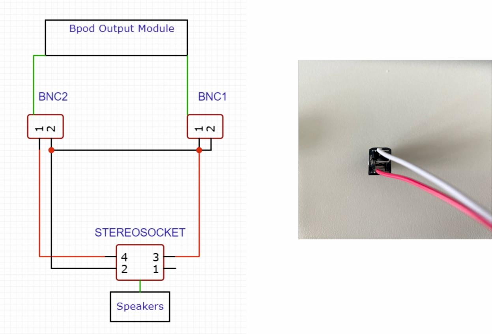

## Water providing system

- Tubes
- Syringe
- Syringe holder (3D design)
- Three-way valve
- Valves
- T-connector

Steps:
1. Attach the Bpod port interfaces with the valves to the T-shaped part of the syringe holder with
   glue.
2. Attach the three-way valve to the syringe and insert it into the holder.
3. Connect the three-way valve to the T-connector with a tube.
4. Connect both other ends of the T-connector to the middle input of a valve each, using tubes.
5. Close the input closest to the metal piece of the valves using a tied-up piece of tube.
6. Connect the output of the valves to the spouts using tubes.
7. Connect the Bpod port interfaces to the state machine with an Ethernet cable.

## Camera and recording system

- Camera (we use FLIR Chameleon 3.0 or FLIR Firefly)
- Camera cable
- Custom camera mount
- IR LED
- IR LED holder (print)
- IR mirror
- IR mirror holder (print)

For video recording in each experimental session, we use 2 cameras per setup. Since we use IR
LEDs within the setup, we need to remove the IR filter of all cameras, in the following order:

### First step: IR filter removal

Open the camera carefully. Usually, the CMOS (Complementary Metal-Oxide-Semiconductor) inside the
camera is extremely sensitive. Use a hot air gun to loosen the glue used to fix the filter, remove
the filter, and close the camera.

| | |
|---|---|
| 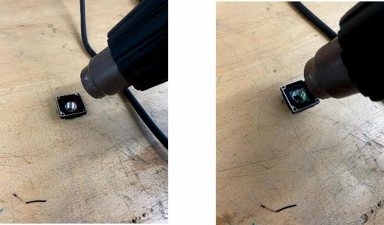 | 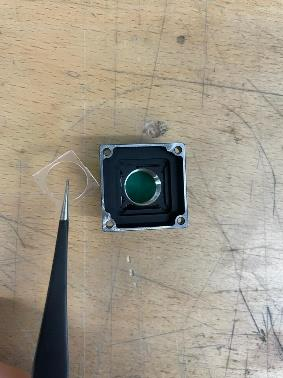 |

### Second step: Mounting the camera

To securely mount the lens onto the camera, install the camera on top of the mounting piece (you
will need very small screws for this step).

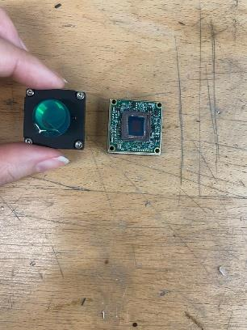
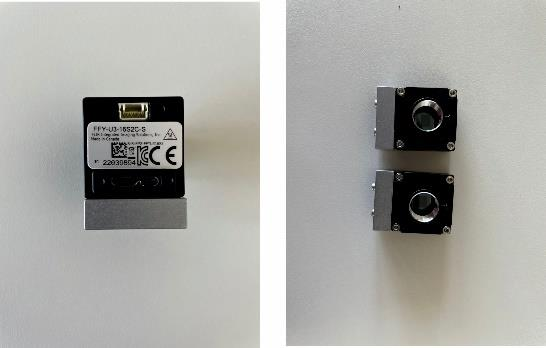

### Third step: Lens mounting

Each lens has a fixation ring which needs to be installed first. There is a small screw on top of
the camera lens holder which you need to unscrew first to fit the lens. Screw the lens into the
camera.

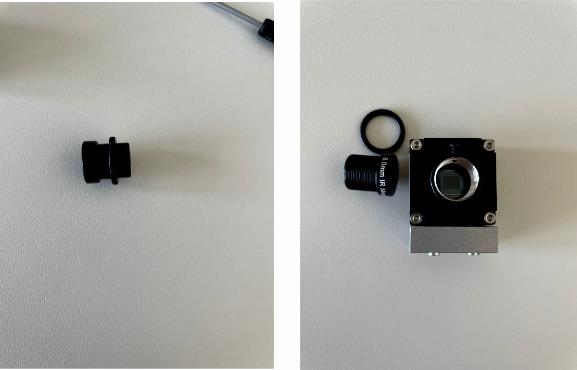
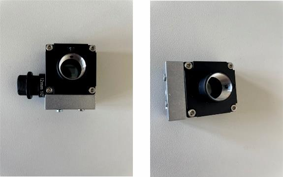
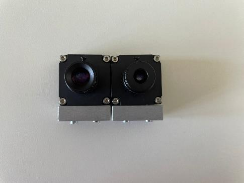

Now connect the camera to the PC and adjust the field of view and sharpness for the platform where
the animal will sit later (tip: use a dummy for this). Use SpinView for this purpose — see the
Labcams installation section below for setup instructions.

### Fourth step: Mounting the IR LED

After printing the IR LED mount, mount the LED on it and fix it using small screws. Each camera
needs one IR LED. Check that the lighting in your video is adequate and adjust its direction as
needed by checking the camera view in SpinView.

### Optional step: Mounting the IR mirror

Depending on your setup, you can use an IR mirror for a better view of facial movements. Print the
IR mirror holder, stick an IR mirror on top of it, and adjust its direction using SpinView.

## Bpod system

- Bpod state machine (here we use Bpod State Machine r2.5)
- Bpod input module
- Bpod output module
- Bpod port interface
- Bpod Teensy shield
- Bpod ambient module
- Bpod rotary encoder module

The first step is to connect the various components of Bpod, as illustrated below:

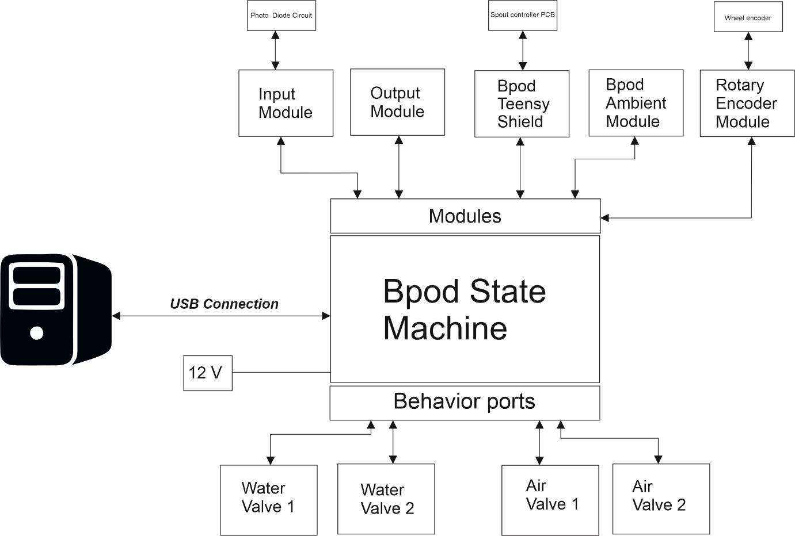

After connecting all the components, set up Bpod on your PC using MATLAB:

1. Bpod_Gen2 is already vendored in this repository at
   [`third_party/bpod_gen2`](../third_party/bpod_gen2) (originally from
   [github.com/sanworks/Bpod_Gen2](https://github.com/sanworks/Bpod_Gen2)).
2. Add `third_party/bpod_gen2` to the MATLAB path.
3. Run `Bpod()` at the MATLAB command prompt.

You are all set to run Bpod.

## Labcams installation

> The installer files this section references (zipped `labcams-main` repository, the FLIR camera
> driver `.whl`, the SpinnakerSDK installer, and a starter `default.json`) are not included in
> this repository. Obtain the labcams source from
> [github.com/jcouto/labcams](https://github.com/jcouto/labcams) and the SpinnakerSDK/camera
> driver from FLIR/Teledyne directly.

You may follow the instructions at the [labcams repository](https://github.com/jcouto/labcams), or
follow these steps:

1. Install [Anaconda](https://conda.io/anaconda.html) if not already done, and add conda to the
   system PATH when asked during installation.
2. Obtain the labcams repository, the FLIR camera driver Python wheel
   (`spinnaker_python-2.5.0.80-cp38-cp38-win_amd64.whl`), the SpinnakerSDK installer
   (`SpinnakerSDK_FULL_2.5.0.80_x64.exe`), and a `default.json` file (see note above).
3. Download [Notepad++](https://notepad-plus-plus.org/downloads/v8.3.3/).
4. In the Anaconda prompt, create a new virtual environment called `labcams` with a downgraded
   3.8.12 version of Python:
   ```
   conda create -n labcams python=3.8 anaconda
   conda activate labcams
   ```
5. Open the labcams repository folder in Anaconda: `cd labcams-main`
6. Install the downgraded version of the PyQt package: `pip install PyQT5`
7. Install the remaining labcams requirements: `pip install -r requirements.txt`
8. Install the labcams software: `python setup.py develop`
9. Install SpinnakerSDK.
10. Install the camera driver: `pip install spinnaker_python-2.5.0.80-cp38-cp38-win_amd64.whl`
11. Generate the `default.json` file: `labcams`
12. Edit the `default.json` file (e.g. add the camera serial number) or copy and paste your own.
    Note: labcams only uses the filename `default.json`.
13. Install ffmpeg (only if you are capturing video): `conda install -c conda-forge ffmpeg`

To run labcams in the future, activate the labcams virtual environment first in the Anaconda
prompt (`conda activate labcams`) and then run `labcams`. Alternatively, add
`c:/users/YOURUSER/Anaconda3/envs/Scripts` and `bin` to the environment PATH on Windows.
